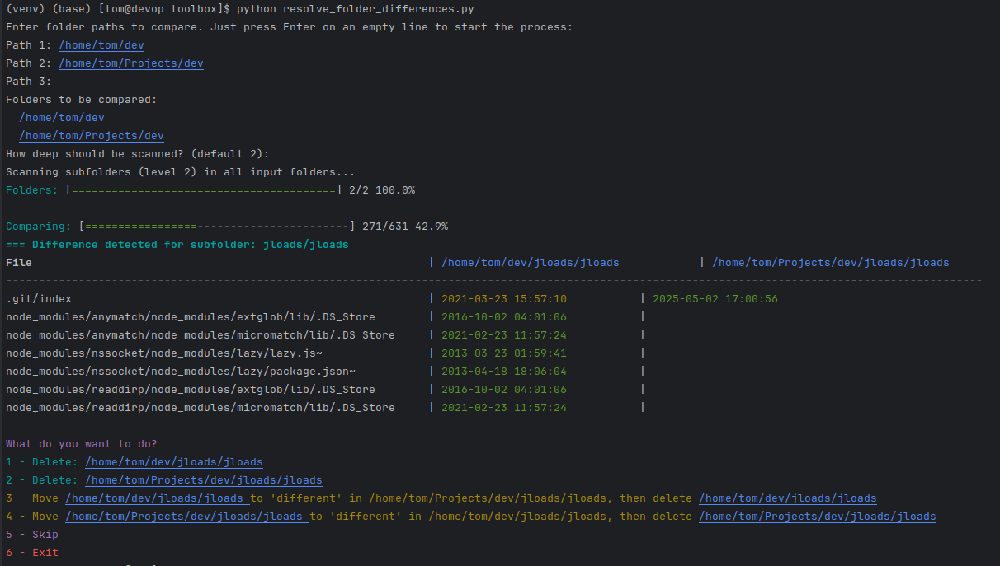

# Cleaner Toolbox

This `toolbox` folder contains a set of simple, interactive utilities for cleaning up files and directories on your computer. Each tool is a separate Python script, launched from a central menu.


## How to run?

1. Go to the toolbox directory:
   ```bash
   cd toolbox
   ```
2. Activate your virtual environment (if needed):
   ```bash
   source ../venv/bin/activate
   ```
3. Start the menu:
   ```bash
   python menu.py
   ```

## Tools Overview

- **compare_equal_folders.py** – Compare contents of folders up to a chosen depth, log equal folders, and show progress.
- **git_projects_audit.py** – Audit local git projects, check remote existence and equality, log results.
- **clean_empty_dirs.py** – Remove empty directories recursively.
- **find_big_files.py** – Find and list the largest files in a directory tree.
- **batch_compare_folders.py** – Batch compare multiple folders and show results.
- **move_batch_duplicates.py** – Move detected duplicate folders/files in batch mode.
- **resolve_folder_differences.py** – Powerful, interactive N-way folder comparison and resolution tool (see below).
- **find_similar_projects.py** – Wyszukuje w wybranej lokalizacji grupy folderów-projektów o podobnej strukturze (np. pliki, podfoldery). Wynik: gotowe grupy ścieżek do porównania narzędziem resolve_folder_differences.py. Przy każdym folderze pokazuje liczbę plików (rekurencyjnie) i całkowity rozmiar.

## resolve_folder_differences.py

Interaktywny skrypt do porównywania podfolderów (do wybranej głębokości) w wielu katalogach bazowych. Pozwala szybko wykryć i rozwiązać różnice w strukturze projektów, nawet dla dużych zbiorów.

### Najważniejsze funkcje:
- **Porównanie N folderów naraz** – Wprowadź dowolną liczbę ścieżek do katalogów do porównania.
- **Dogłębna analiza** – Porównuje wszystkie pliki w podfolderach (do wybranej głębokości), wykrywa brakujące i różniące się pliki.
- **Tabela różnic** – Przejrzysta, szeroka tabela z pełnymi ścieżkami folderów i datami modyfikacji plików (najstarsze/nowe podświetlone kolorami). Wyświetlane są tylko pliki, które się różnią.
- **Interaktywne menu** – Dla każdej grupy różniących się podfolderów możesz: usunąć wybrany folder, przenieść wybrany folder do subfolderu `different` w innym i usunąć oryginał, pominąć lub zakończyć.
- **Obsługa .ignore** – Plik `.ignore` (tworzony automatycznie) pozwala wykluczyć z porównań katalogi i pliki (np. `.git`, `.idea`, `venv`).
- **Kolorowy, czytelny interfejs** – Kolory dla nagłówków, dat, menu, paska postępu.
- **Pasek postępu** – Wskazuje postęp skanowania i porównywania.
- **Informacja o braku różnic** – Czytelny komunikat, jeśli nie znaleziono żadnych różnic.
- **Dowolna głębokość skanowania** – Na starcie wybierasz głębokość (domyślnie 2).

### Szybki start

1. **Dodaj katalogi do porównania:**
   ```bash
   python resolve_folder_differences.py
   ```
   Podaj ścieżki do katalogów, zakończ pustą linią. Zostaniesz zapytany o głębokość skanowania.

2. **Dostosuj wykluczenia:**
   Edytuj plik `.ignore` w katalogu toolbox, aby wykluczyć nieistotne katalogi/pliki.

3. **Postępuj zgodnie z menu:**
   Skrypt wyświetli różnice i zapyta o akcję dla każdej grupy podfolderów.

### Przykład wykluczania

Plik `.ignore` (domyślnie tworzony z wpisem `.git`):
```
.git
.idea
venv
*.log
```




### Wymagania
- Python 3.7+
- Terminal obsługujący kolory ANSI

### Autor
Tom Sapletta

## find_similar_projects.py

Ten skrypt pozwala automatycznie odnaleźć podobne projekty w dużej strukturze katalogów. Ułatwia szybkie przygotowanie listy ścieżek do dalszego porównania.

### Funkcje:
- Wskazujesz ścieżkę startową oraz głębokość penetracji (domyślnie 2).
- Skrypt wyszukuje foldery, które wyglądają jak projekty (np. zawierają setup.py, .git, package.json, itp.).
- Grupuje projekty o bardzo podobnej strukturze plików i folderów.
- Dla każdej ścieżki pokazuje liczbę plików (rekurencyjnie) oraz rozmiar całkowity folderu.
- Wynikiem są grupy ścieżek, które możesz podać do resolve_folder_differences.py.

### Przykład użycia
```
python find_similar_projects.py
Enter root path to search for projects: /home/tom/Projects
How deep should be scanned? (default 2): 2

Groups of similar projects:

Group 1:
  /home/tom/Projects/app1   files:   123   size: 12.3 MB
  /home/tom/Projects/app2   files:   121   size: 12.2 MB

You can use the above paths as input to resolve_folder_differences.py for comparison.
```

### Wskazówki
- Im większa głębokość, tym więcej potencjalnych projektów zostanie znalezionych (ale wolniej).
- Możesz edytować plik .ignore, aby wykluczyć katalogi typu .git, .idea, node_modules itd.
